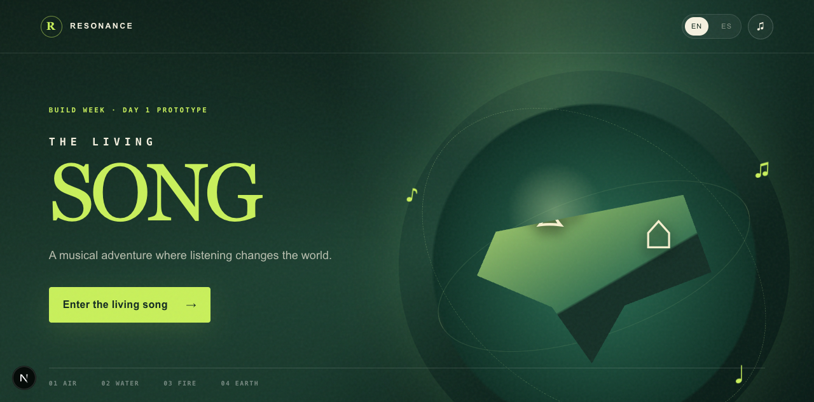
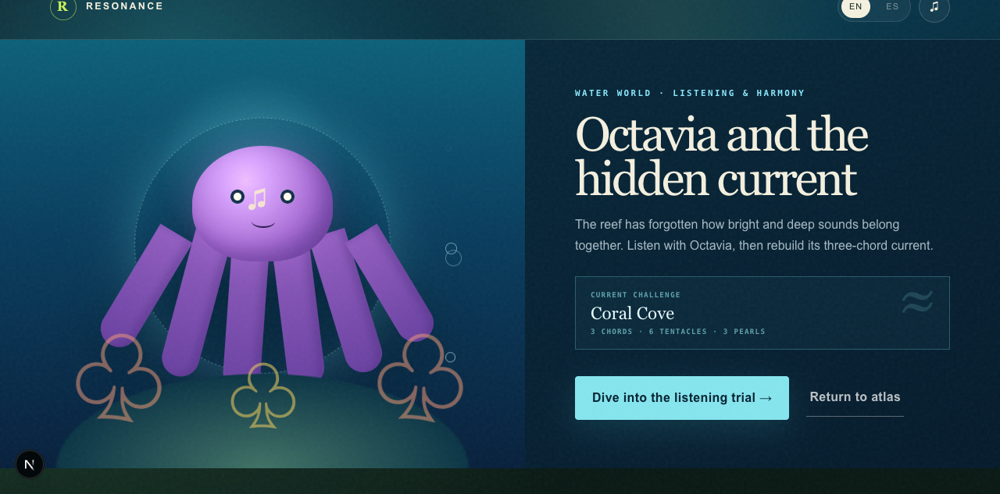

# Resonance: The Living Song · Resonancia: El Canto Vivo

A bilingual musical adventure for OpenAI Build Week. Players restore living worlds by listening, composing, and turning musical ideas into visible change.

Una aventura musical bilingüe para OpenAI Build Week. Los jugadores restauran mundos vivos al escuchar, componer y convertir ideas musicales en cambios visibles.

**Play the Day 3 prototype:** [resonancia-canto-vivo.vercel.app](https://resonancia-canto-vivo.vercel.app)

## Playable loop

1. Hear C–E–G in Grandma Luma's house and find the three sounding objects in order.
2. Open the ecosophic atlas of Air, Water, Fire, and Earth.
3. Compose a four-bar dog-walk by choosing tempo, melodic contour, and instruments.
4. Preview the real synthesized music and offer it to the Air portal.
5. Ask Echo, the GPT-5.6 musical mentor, for concise educational feedback.
6. Hear and compare **My song** with **Echo's variation** in the same scene.
7. Return to the atlas and unlock the Water world.
8. Help Octavia classify major/minor chord colors and reconstruct a three-chord current.
9. Earn harmony pearls, replay a new current, or share an anonymous challenge link.

Progress, the anonymous session UUID, and the latest mentor response are stored only in the browser. Saving the response prevents a reload from creating another paid model call. English is the default; Spanish is available from every scene.

## Verified prototype





The original house → atlas → composition → Air portal loop was browser-tested at desktop size and at 390×844. Day 2 added the live mentor and audible variation comparison. Day 3 expands that loop with a complete Water mission and account-free musical challenges.

## Run locally

Requires Node.js 20.9 or newer.

The repository pins Node 22 in `.nvmrc`, the recommended local version for the team.

```bash
npm install
npm run dev
```

Open `http://localhost:3000`. Audio begins only after a player gesture, as required by browsers.

Copy `.env.example` to `.env.local`, then add a server-only OpenAI project key:

```bash
OPENAI_API_KEY=
OPENAI_MENTOR_MODEL=gpt-5.6-luna
```

Never prefix the key with `NEXT_PUBLIC_`. Without a key, the game automatically uses its disclosed curated fallback.

## Quality checks

```bash
npm run check
```

## Architecture

- Next.js App Router + React + TypeScript
- Tone.js, loaded lazily in the browser after interaction
- OpenAI Responses API with the official JavaScript SDK
- Zod Structured Outputs for both generated text and the playable variation
- `gpt-5.6-luna` with `reasoning: none`, a 420-output-token ceiling, no retries, and `store: false`
- 8-second server timeout, 4 KB payload limit, and best-effort per-session rate limiting
- Vitest for musical mapping, schemas, fallbacks, timeout behavior, route boundaries, and bilingual pedagogy
- One client-side scene state machine so the audio context survives transitions
- `localStorage` key `resonancia:v1` for prototype progress
- A deterministic Water challenge engine with four curated seeds and no additional AI cost
- Six playable diatonic triads, major/minor ear training, order-sensitive harmony reconstruction, and persistent pearl scoring
- Anonymous challenge URLs containing only a curated challenge ID and interface language

### Mentor API

- `GET /api/health`
- `POST /api/mentor/feedback`

`POST /api/mentor/feedback` accepts only constrained musical settings plus a random local UUID—never a name, email, recording, microphone input, or free-form child text. A live answer includes `source: "openai"`; any missing key, refusal, malformed output, timeout, network error, or rate limit returns the same validated contract with `source: "mock"`. The interface labels both sources honestly.

The Day 2 evaluation set covers English and Spanish, all melodic contours, both tempo extremes, and one- to three-instrument arrangements. See [`docs/DAY_2_EVALS.md`](docs/DAY_2_EVALS.md).

The Day 3 design, musical contract, privacy boundary, and completion gates are documented in [`docs/DAY_3_PLAN.md`](docs/DAY_3_PLAN.md).

## Built with Codex

The product concept, scope, architecture, implementation, copy, tests, evaluations, and documentation were developed collaboratively with OpenAI Codex during Build Week. The human team directed the musical pedagogy, worldbuilding, ecosophic purpose, and product decisions.

## Ecosophic direction

The four worlds connect musical learning with human capacities: Air/imagining, Water/feeling, Fire/persevering, and Earth/materializing. The prototype avoids treating nature as decoration: the player's act of attentive listening creates a reciprocal, visible effect in the environment.

## License

MIT. See [LICENSE](LICENSE), [ASSET_LICENSES.md](ASSET_LICENSES.md), and [THIRD_PARTY_NOTICES.md](THIRD_PARTY_NOTICES.md).
